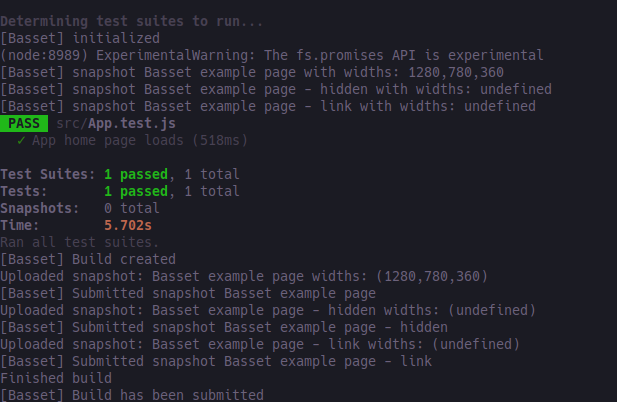

This project was bootstrapped with [Create React App](https://github.com/facebook/create-react-app).

## Basset example app

This react app provides an example of how to setup testing and use basset.

### Prerequisites

- Server running [basset](https://basset.io/docs/getting-started). Record the URL of the application.
- A project created in basset. Record the API Token.

### Steps
1) Fetch the tags: `git fetch --tags`

2) Install the packages: `npm install`

3) Make sure you are on the master branch: `git checkout master`

4) In the project directory run: `npm start`

5) In another terminal run: `BASSET_URL=http://localhost BASSET_TOKEN=1234eaf npm test`

    > BASSET_URL is the url for the basset server. BASSET_TOKEN is the API Token from your project in basset

    You should see an input like this:

    

6) Assuming your tests pass - check the build within Basset. There should be 8 snapshots.

7) Apply the patch `git apply ./modify-justify-content.patch`

8) Repeat step 5 (assuming `npm start` is still running). You should see the same output.

9) Check the new build within Basset. There should now be 7 modified snapshots and 1 unmodified (the link text snapshot)
